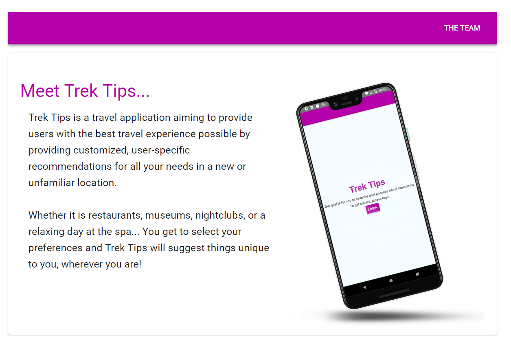

# Trek Tips Homepage
##### Information Page for our Trek Tips Mobile Application

Trek Tips is an Mobile Application using React native currently in development.  This is the information page for the application.



## Getting Started

These instructions will get you a copy of the project up and running on your local machine for development and testing purposes.  See deployment for notes on how to deploy the project on a live system.

### Prerequisites

In order to install and run this information page on your own device you will need to be able to run MongoDB, in addition to needing the following npm packages:

```
Node.js
Express.js
Mongoose
Axios
```

### Installing

You will need to do the following steps after cloning the repo to your device in order to ensure that it works properly.

To ensure Node.js is running within the package and configure all modules for use:

```
npm install
```

This should install all the requisite modules for the server and then cd into the client folder to install all the modules required there.  following this installation check to make sure that you have a node_modules folder in both the root directory and within the 'client' folder and things should be ready to run.

```
For the Server:
express             
axios               
if-env              
mongoose            
concurrently        

For the React App:

@material-ui/core
@material-ui/icons
axios               
prop-types          
react               
react-dom       
react-router-dom    
react-scripts
react-transition-group               
```

## Running 'Trek Tips Homepage'

To run locally you will need to have MongoDB running on your computer, you can then begin the server simply by path into the root folder for the application and running:

```
npm start
```

As per the package.json... with it being in dev mode (which is checks for), it will run ```nodemon --ignore 'client/*'``` (Starting the server and ignoring the contents of the client folder, which houses the React Application) concurrently with running ```npm run client``` = ```cd client && npm run start```which grabs the client folder and starts the React Application running on proxy port 3001. If all runs smoothly you should see another browser tab open and navigate to the site.

## Deployment

* [Deployed Site](https://trek-tips-info.herokuapp.com/)

I personally have this application deployed using Heroku, with mLab serving serving as the remote MongoDB database.  The steps to deploy in this manner are as follows:

Initialize your own copy of the project as a Git Repo if you have not already done so using:
```
git init
```

Create a heroku app on the heroku website, this is where you will be pushing the project to for deployment.  Then add the mLab Addon for the MongoDB Database.

Add and commit your changes on your own device before pushing to Heroku (the first command will be provided for you by Heroku):
```
heroku git:remote -v <name of your heroku application>
```
Then:
```
git push heroku master
```
Heroku automatically sets the NODE_ENV to Production and will thus run the build commands within the package.json.

### External Links (In Development)
* [App Repository](https://github.com/parkmee/trek-tips)
* [Server Repository](https://github.com/parkmee/trek-tips-server)

## Built With

* [React](https://reactjs.org/) - JavaScript Library
* [Material-UI](https://material-ui.com/) - CSS Framework
* [Node.js](https://nodejs.org/en/) - Runtime Environment
* [Express.js](https://expressjs.com/) - Web Framework
* [Mongoose](https://mongoosejs.com/) - MongoDB Object Modeling
* [MongoDB](https://www.mongodb.com/) - Database
* [gitignore.io](https://www.gitignore.io/) - For creating the .gitignore
* [WebStorm](https://www.jetbrains.com/webstorm/) - JavaScript IDE

## Authors

* **Dalton Ricker** - *Primary Author* - [SasquatchXYZ](https://github.com/SasquatchXYZ)

## Acknowledgments
* Many thanks to my instructors & TAs, as well as the O'Reilly reference books.

